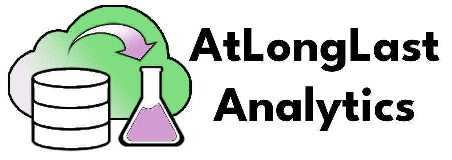

# Welcome to AtLongLastAnalytics 

AtLongLast Analytics helps organizations integrate data with their business processes to make meaningful changes to how they operate. We do this by providing expert services in data engineering and analytics, data strategy support and Azure cloud solutions.

On our GitHub page, we share open-source software to make new capability more accessible to the wider community and educational projects which demonstrate real-world solutions using typical technologies.

🌱 We will be adding **exciting new** code repositories over the coming months!

## Stay Connected

Let's stay connected! Feel free to reach out to us on the following platforms:

This page is managed by our founder Robert Long and he'd love to hear from you. If you would like to message him directly or read his other content, contact Rob on his LinkedIn:

---

## Our Projects
Our open-source software projects include:

- ✅ **VISaR**
  [Technical Article](comingsoon) | 
  [GitHub Repo](https://github.com/AtLongLastAnalytics/visar)
  - VISaR (Vulnerability Identification, Scanning and Reporting) provides an end-to-end solution for automated vulnerability scanning aimed at delivering actionable insights for data engineers, software developers and hobbyists.

Some educational courses are coming soon, completely free! 

Please subscribe, like and comment on our channels, your enagement means the world to us and helps the channel!

---

